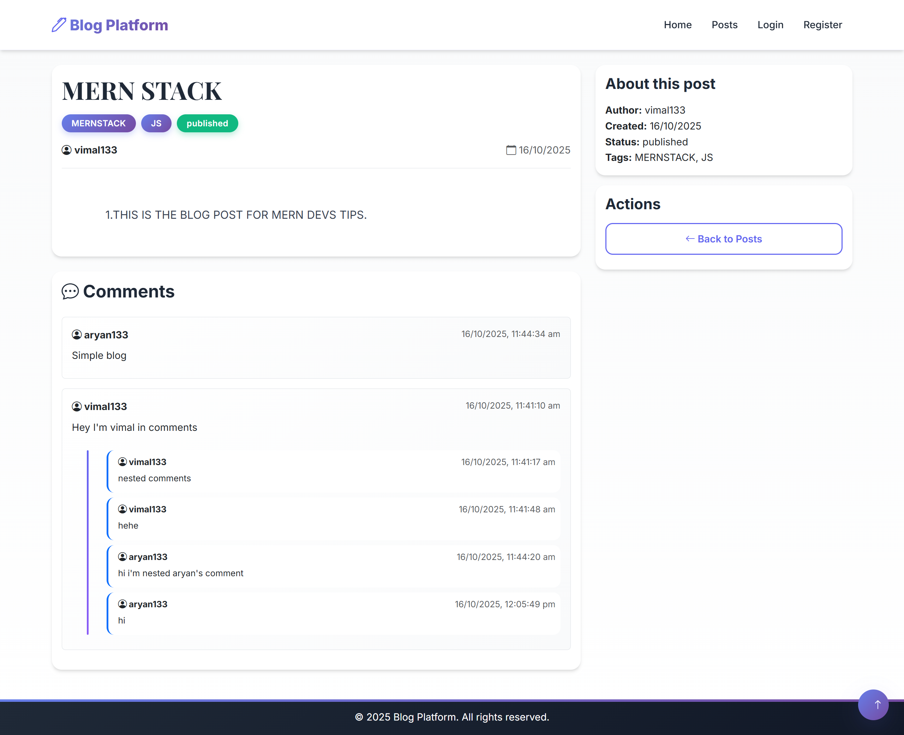
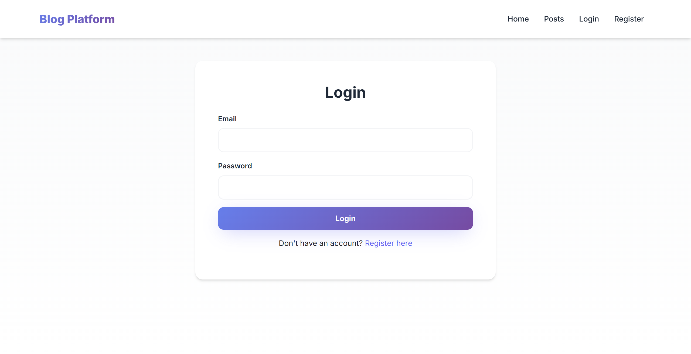
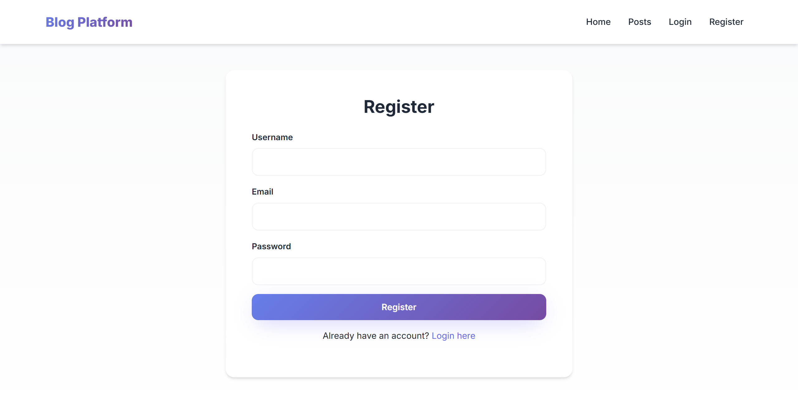
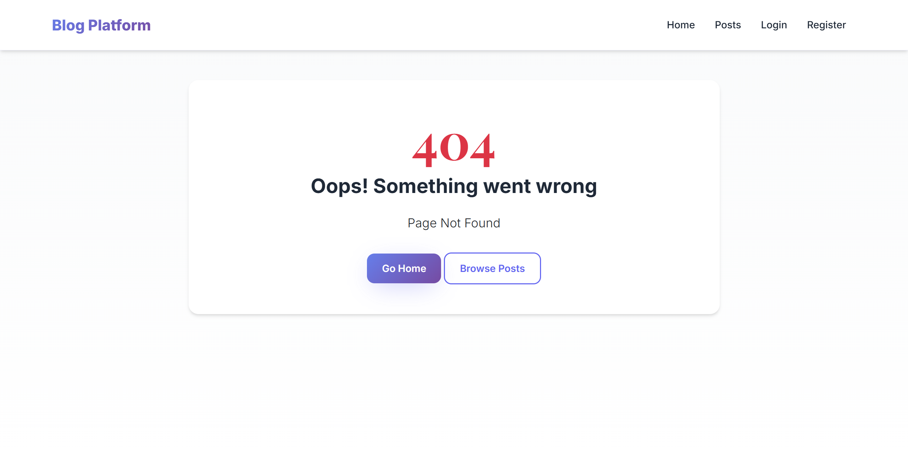

# Backend-assessment-MJTECHLABS
Just a ejs,express backend blog app.

### 📸 Watch Project Video here👇
--[🎬 Watch Demo on Google Drive](https://drive.google.com/file/d/1YINlMHVngSnAyhUf0uPAnm2JJ9hx7Mzu/view?usp=sharing)

### 📸 Screenshots

### Home Page


### All Posts


### Single Post with Comments


### Login Page


### Register Pagw


### Error Page



---

## 📝 Blog Platform

A complete Express + MongoDB + EJS blogging application with user authentication, CRUD operations for posts, nested comments (up to 2 levels), tag system, and modern responsive design.

---

## 🛠️ Tech Stack

* 🖥️ **Backend:** Node.js + Express.js
* 🗄️ **Database:** MongoDB + Mongoose
* 🎨 **Templating:** EJS (Embedded JavaScript)
* 🔒 **Authentication:** JWT (JSON Web Tokens)
* ✅ **Validation:** Joi Schema Validation
* 💅 **Styling:** Bootstrap 5 + Custom CSS
* 🗂️ **Structure:** MVC architecture with custom middleware

---

## ⚙️ Setup

Follow these steps to get the project up and running on your local machine.

**1. Clone the repository:**
```bash
git clone https://github.com/yourusername/blog-platform.git
```

**2. Navigate to the project directory:**
```bash
cd blog-platform
```

**3. Install dependencies:**
```bash
npm install
```

**4. Create .env file:**
```env
PORT=3000
MONGO_URI=mongodb://localhost:27017/blogPlatform
JWT_SECRET=your_super_secret_jwt_key
SESSION_SECRET=your_super_secret_session_key
```

**5. Start MongoDB:**
```bash
mongod
```

**6. Start the application:**
```bash
npm start
```
Or for development mode:
```bash
npm run dev
```

**7. Open in your browser:**
```
http://localhost:3000
```

---

## ✨ Features

* 🔐 User registration & login with JWT
* 📝 Create, edit, delete blog posts
* 💬 Nested comments (2 levels deep)
* 🏷️ Tag system for posts
* 📄 Draft/Published status
* 🗑️ Soft delete functionality
* 🎨 Premium responsive UI
* 🔒 Protected routes & authorization

---

## 📦 Quick Start

```bash
npm install
npm start
# Visit http://localhost:3000
```

---

**Made with ❤️ using Express + MongoDB + EJS**


